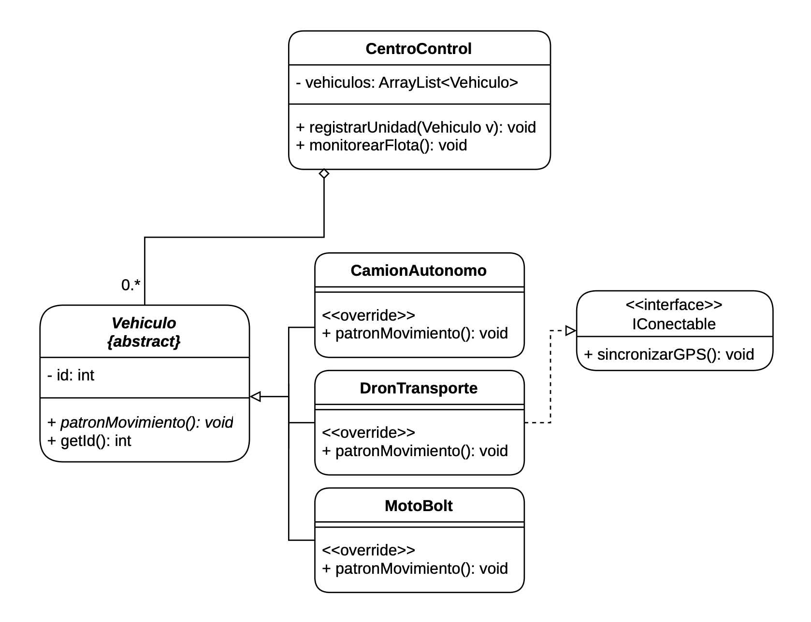

# 🚛 Sistema de Ecosistema Logístico Inteligente

> Práctica de Programación II — Ingeniería Informática, 2.º Semestre  
> Docentes: Ma. Nieves Florentín & Arnaldo Ocampo                   
> Miembros: Esteban López & Mauro Caballero

---

## 📋 Descripción

Sistema en Java que simula el núcleo de gestión logística de una **ciudad inteligente**, modelando distintos tipos de unidades de transporte mediante los principios de **POO**: abstracción, herencia, interfaces y polimorfismo.

---

## 🏗️ Arquitectura del Sistema

### Diagrama UML



---

## 🧩 Estructura del Proyecto

```
src/main/java/
├── Programa.java              # Programa ejecutable (main)
├── abstraccion/
│   └── Vehiculo.java          # Clase abstracta base
├── interfaces/
│   └── IConectable.java       # Interfaz de comportamiento
├── polimorfismo/
│   ├── CamionAutonomo.java    # Implementación específica
│   ├── DronTransporte.java    # Implementación específica
│   └── Motobolt.java          # Nueva subclase concreta
└── composicion/
    └── CentroControl.java     # Gestión y orquestación de la flota
```
---

## 🔑 Conceptos Aplicados

| Ejercicio | Concepto | Elemento |
|-----------|----------|----------|
| 1 | Clase abstracta + Herencia | `Vehiculo` → `patronMovimiento()` |
| 2 | Interfaz (contrato) | `IConectable` → `sincronizarGPS()` |
| 3 | Polimorfismo + `@Override` | `DronTransporte`, `CamionAutonomo` |
| 4 | Composición + Agregación | `CentroControl` + `ArrayList<Vehiculo>` |

---


## 📌 Notas de Diseño

- `Vehiculo` es **abstracta**: no puede instanciarse directamente, garantiza que cada subclase defina su propio `patronMovimiento()`.
- `IConectable` es una **interfaz**: representa un *comportamiento opcional* (conexión satelital), no una identidad.
- `CentroControl` usa **composición** (`ArrayList` interno) y **agregación** (recibe vehículos externos vía `registrarUnidad()`).
- `monitorearFlota()` demuestra **polimorfismo en tiempo de ejecución**: llama `patronMovimiento()` sin conocer el tipo específico de cada unidad.

---

## 🛠️ Tecnologías


